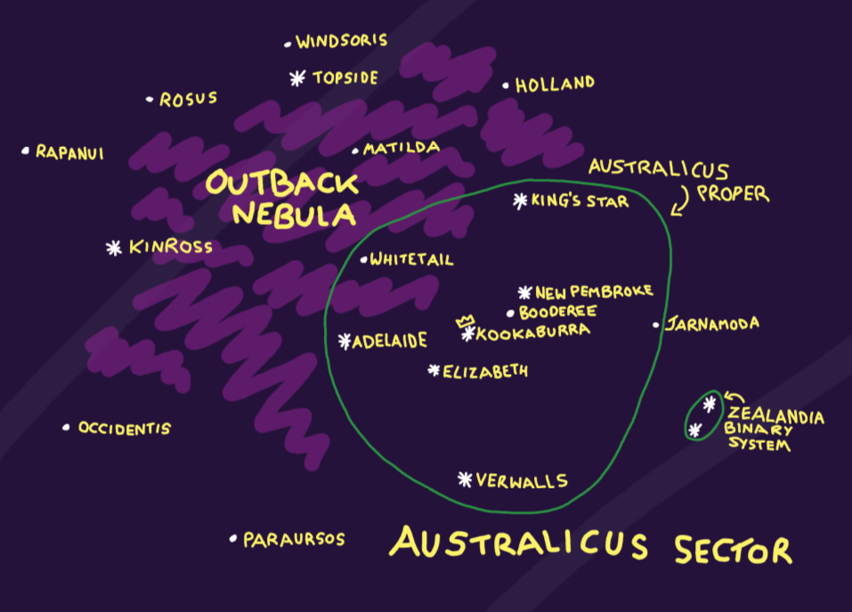
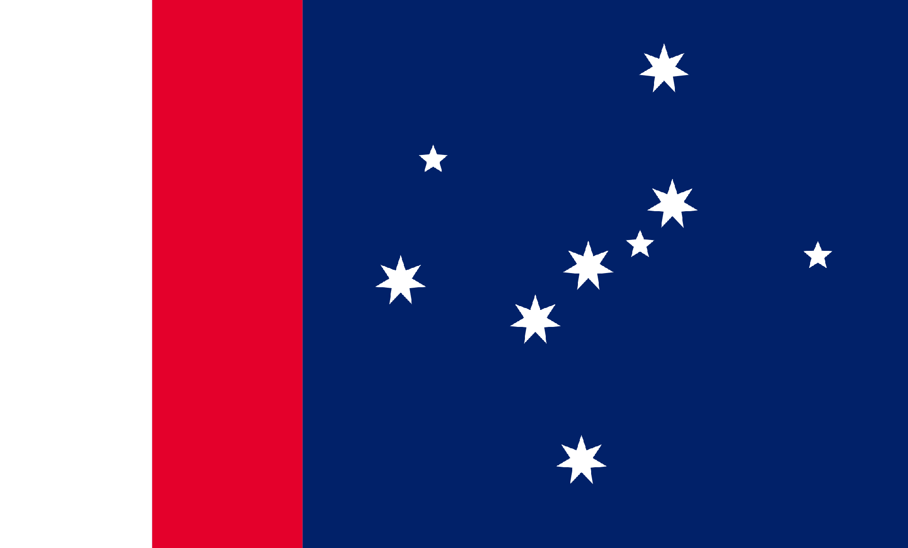

# The Australicus Sector
> "Course, once you get past the beasties, and the weather, and all that stuff... yeah, it's a fair dinkum place, really."

A sector in name only, the Australicus Sector is a subdivision of the Spinward Near Rim once used as a penal colony, and today known galaxywide for its hostile conditions, dangerous wildlife, and friendly populace.

In terms of habitability, the Australicus sector is considered a minor miracle, with 18 fully habitable planets spread across its stars. Such unprecedented density of habitability, however, comes at a cost- the planets are home to an incredible array of flora and fauna, most of which wants you dead. While the Australican spiders are the most famous inhabitants, special mention also must be given to such species as the Kinross Redhead Snake, the River Snapper, and especially to the Drop Bear.

Constituting a federation of 11 stars (Kookaburra, Verwalls, Adelaide, Elizabeth, King's Star, New Pembroke, Kinross, Topside and the two stars of the Zealandia Binary System, Majoris and Minoris), alongside a number of outlying territories, the Australicus sector has its own legislature, which represent it as a federal entity at the TerraGov Senate.

- Star Chart of the Australicus Sector

### Prison Worlds
First surveyed during the first Spinward Rush, the 11 primary stars of the Australicus Sector were of particular notability for their habitability; numbering 15 planets regarded as fully habitable, alongside a number of potential terraforming candidates, the sector promised a future as a breadbasket, or even for permitting dense population of the type previously relegated to only a few planets across the Terran domain. However, this habitability cuts both ways: while the conditions are perfect for humans, they are also perfect for an incredible variety of local flora and fauna, most of which is incredibly hostile to human life.

For these reasons, the various stars of the sector were mostly passed by for colonial endeavours, with small mining stakes being the only permanent population. However, as the Terran population expanded, and the need for prison space continued to expand, the Australicus Sector found its footing as a penal colony: prisoners would be shipped to the planets and act to set up new colonies there, in exchange for their freedom (in the sector, at least) after a period of forced servitude. After a while, free colonies also came to be set up, as penal workers found new sources of minerals and built an economic foundation onto which the rest of the sector could contribute.

This was the way of life in the Australicus Sector for around 100 years, during which tens of thousands of penal colonists, and as many free colonists, made their way to the region. Eventually, as the number of free colonists outnumbered those there under penal conditions, and better locations for prisons and penal colonies became available, transportation to the sector dwindled and, within a few decades, the status of the Australicus Sector as a prison was ended; shortly afterwards, the systems federated, and Australica was accepted into the wider Terran Federation.

### Australicus Federation

## Geography of the Australicus Sector
## Australicus Proper

### Kookaburra and Booderee
Although technically comprising of two separate star systems, Kookaburra and Booderee are generally lumped together as the central portion of the Holland Line, and due to the low population of the Booderee system. Kookaburra is the capital of the Australicus Sector, despite being a small system by Australican standards. This is mostly due to its position roughly at the median between the three most populous systems of the sector: Elizabeth, New Pembroke and Adelaide. Kookaburra has two planets, the capital itself, Union, and the uninhabited dustball, Franklin. Booderee has no fully habitable planets, although Crestpoint is populated with a few scattered mining settlements, and is considered a potential candidate for terraforming.

### Adelaide

### Elizabeth

### King's Star

### New Pembroke
While Kookaburra might today be the capital of the Australican Federation, New Pembroke was the first of the sector's systems to be settled by humans, and remains the most populous of the various stars of the sector, with around 1/5th of the total population of Australica spread across its four habitable planets. The largest settlement in New Pembroke is Arthurstown, located on the planet Albion, which is famous across the galaxy for its golden shores and crystal-clear seas.

### Kinross

### Topside
Of the primary Australican systems, Topside has the dubious honour of being the least habitable, with only one of its three planets having a breathable atmosphere. This planet is Earlmont, a desert world where the surface temperatures routinely hit above 60oC; for this reason, most of the settlements on Earlmont, including its largest, Copperhead, are built down into the rock, which helps to keep them cool enough to be liveable.

### Verwalis

Rumours abound about the Verwalis system, with local legend saying that it's haunted by the ghosts of explorers past. Some fringe theorists posit that the entire system is located within a Delta-Void zone. No matter what causes it, however, many travellers within the system report feeling disconcerted or paranoid, that there are "unexplainable" events on their ships, and that a certain melancholy hangs heavy across everywhere the light from Verwalis touches.

### Zealandica Binary System
Long considered the black sheep of the Australicus Federation, the twin stars of the Zealandica System (Zealandica Majoris and Zealandica Minoris) are unique in that they were never host to any penal colonies; due to this, and their distance from the wider sector, the Zealandicans have a similar, yet distinct, culture to that of Australicans. This manifests as a friendly rivalry between the Zealandicans and the rest of the Australicus Sector, mostly about who's better at rugby and who invented various desserts.

The largest city of the Zealandican systems is Lancaster, located on Waterloo. In comparison to the wider sector, the planets of the Zealandican systems have mild climates and less hostile fauna, which has permitted them to become agricultural powerhouses.

### Outlying Territories

## Population of the Australicus Sector
In the centuries since its first settlements, the Australicus Sector has attracted a wide variety of settlers. After the initial waves of penal settlement came extensive waves of free settlers, each bringing with them their own culture and traditions. Throughout the years, this has formed a melting pot, giving the Australicus Sector a cosmopolitan culture that's defined by sardonic humour, a tendency towards non-seriousness, and a hospitality famous across the Terran Federation.

Following the cessation of first-contact hostilities with the Tiziran Empire, the Australicus Sector became host to a small Tiziran émigré population, which has grown throughout the years into a sizeable minority, giving the Australicus Sector one of the highest relative populations of Tizirans within human space outwith of lands annexed as part of the Human-Lizard wars. Although the migrant community has reached a sufficient age to be mostly integrated, a few vestiges of old Tiziran culture have formed an integral part of Tiziro-Australican life, including the use of a pidgin language blending Federal Common and High Draconic (and an accent best described as "interesting"), the carrying forth of a number of Tiziran religions, and a number of adapted dishes that have become popular across the wider Australican culture. The cultural community is so old and so well-integrated that, for many Tiziro-Australicans, a life under TerraGov is all they've known, with little connection to their ancestor's homeworld. Unfortunately, the general tension between the Terran and Tiziran governments has also made life difficult for the Tiziro-Australicans, with each successive war bringing a new wave of hostility towards them from their human neighbours.

The Australicus Sector has also become an important destination for Ethereals leaving Sprout, as a number of the Australican planets are quite similar to Sprout in terms of environment. Of particular value are Ethereal Trailwardens, whose survival expertise is considered priceless for colonial efforts on some of the sector's most inhospitable planets.

Other alien expat communities within the Australicus Sector include scattered moths that chose to remain following visits to the sector by the Grand Nomad Fleet.
