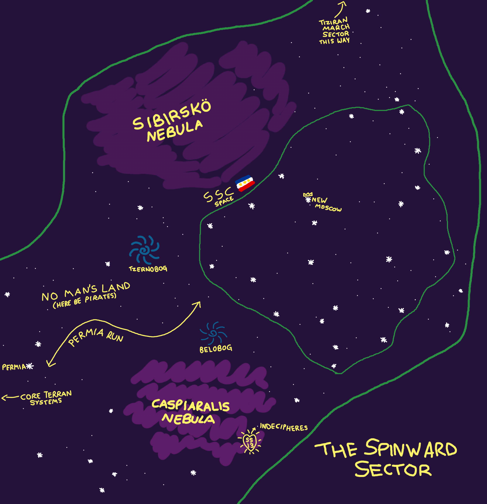

## Geography of the Spinward Sector

- Star Chart of the Spinward Sector

The Spinward Sector has no truly defined borders, as it is not a true sector of the Terran Federation- however, it is generally held to consist of the stars between Permia, on the periphery of the Terran Federation, and Terminus, which is held as the start of the Tiziran Marches and the extent of the Tiziran Empire's current territorial claims. This encompasses a large number of stars, of which roughly half fall within the territory of the Spinward Stellar Coalition. The outlying territories are typically further divided according to their proximity to the Sector's twin nebulas- Caspiaralis and Sibirsko- with the dividing line between these two regions being the Permia Run, and the region "north" of the SSC's borders being typically referred to as the Frontier Region.

## Sibirsko Region
The Sibirsko Region lies to the "north" of the Permia Run, and is, as the rest of the outlying territories of the region are, sparsely populated. While officially owned by no entity, Cybersun is typically held to be the dominant power in the Sibirsko Region, with New Toyohara in the Karafuto System as the largest settlement.

### Karafuto System
As corporations came to the Spinward Sector, so came corporate-sponsored colonies- and Cybersun was no exception. Surveying the systems, Cybersun's Frontier Development division settled upon a system with no inhabitable planets, a decision which confused those observing the company from the outside. Those observers could, of course, not know that Karafuto would be one of the most mineral rich systems in the region.

A number of Cybersun subsidiaries now operate regional headquarters in the Karafuto system, including CSMD and Edo-Ka; however, the undisputed leadership of Karafuto falls to Ichikawa-Exagon, who leverage the mineral wealth of the region to immense profit.

### Tzernobog Black Hole
At the centre of the Sibirsko Region lies the black hole Tzernobog. Named for the Slavic God of Death, Destruction and Misfortune, the black hole has earned its name, being considered the focal point of a major Delta-Void Region by spacers in the region.

## Caspiaralis Region
The Caspiaralis Region makes up the "southern" portion of the Spinward Tail. Just as Sibirsko is practically controlled by Cybersun, Caspiaralis is dominated by Nanotrasen, with NTCC-SS being located in the Lincoln System. Additionally, the Caspiaralis Region is home to the corporate jewel of the Spinward Sector- the Kokytos System, home to Indecipheres and Freyja- and the motherlode of plasma held beneath their surfaces.

### Lincoln System
The Lincoln System is the centre of Nanotrasen's operations within the Spinward Sector, and is the location of most of Nanotrasen's regional administrative capacity. This includes NTCC-SS, Nanotrasen's Central Command for the Spinward Sector, which acts as Corporate's primary base of operations, as well as the regional headquarters for a number of Nanotrasen's involved subsidiaries.

### Belobog Pulsar Star
On the edge of the Caspiaralis Nebula itself lies Belobog, a pulsar star named for the Slavic God of Light and the Sun. Despite its more positive name, spacers tend to avoid it just as much as they do Tzernobog, although for different reasons. While Tzernobog is considered unlucky, Belobog is outright dangerous to local ships, due to the incredibly strong electromagnetic radiation it releases being harmful to onboard systems.

### Kokytos System
The Kokytos System is part of a small cluster of stars on the far side of the Caspiaralis Nebula from the rest of the region, being difficult to reach as a result. This system is considered Nanotrasen's most important asset in the region, being home to both Indecipheres and Freyja (and SS13, as a result!), and this also makes it a major target for the Syndicate. Unfortunately, just as the Caspiaralis Nebula gives the system cover, it also makes it difficult to fully defend.

## Frontier Region
If the Spinward Sector is sparsely populated, the Frontier Region is practically deserted. Very few live beyond the SSC, with most of the population being wildcat miners and mad prospectors seeking fortune at the edges of human space. Indeed, there are only a few permanent settlements in the region, of which the majority are SSC outposts to secure the portion of the Atiron Route that runs between their territory and the Tiziran Marches.

# The Permia Run
The Permia Run is a key trade route, running between the Terran outpost system of Permia and the SSC-controlled system of Valeris Major. With the majority of the trailward portion of the Spinward Sector being Terra Nullius, piracy is a major concern for ships passing through the region. For this reason, the FVZ and Terran Navy operate joint patrols of this "safe" corridor to keep a channel open between the SSC and Terran territory. The Permia Run also forms a key part of the wider Atiron Route between the Terran Federation and Tiziran Empire, which runs via the Spinward Sector. Although not as busy as other trade routes between the two powers, the Atiron Route is an important artery nonetheless, and due to the relative lawlessness of parts of the route (and the ease of bribing Spinwarder officials) sees widespread use by smugglers bringing Tiziran goods into Terran territory, and by political refugees leaving the Tiziran Empire to seek asylum.